# Aurora

A comprehensive UI overhaul for World of Warcraft Vanilla 1.12.1.

## Features

- 900+ customizable options
- Many animations and transitions
- 2-way edit mode
- Unique features and enhancements
- Complete interface redesign (ALPHA PHASE / REPORT BUGS)

## Screenshots

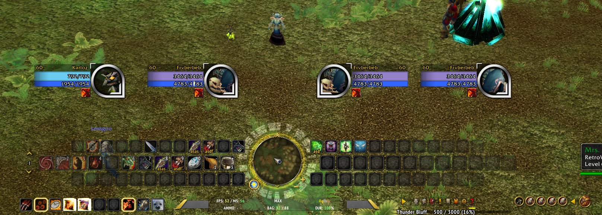
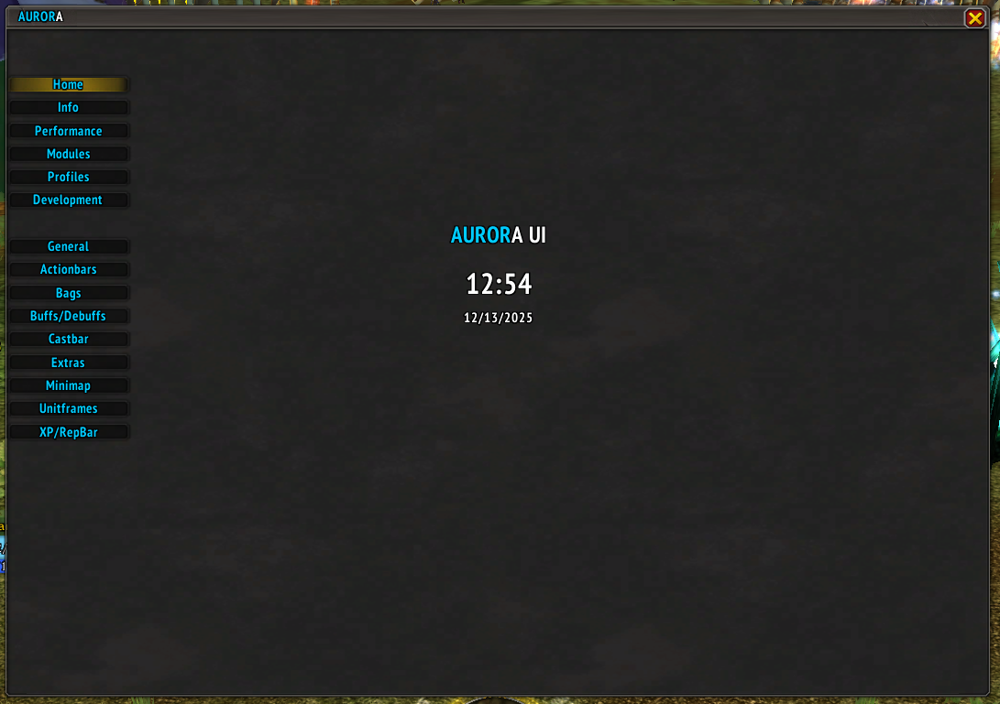
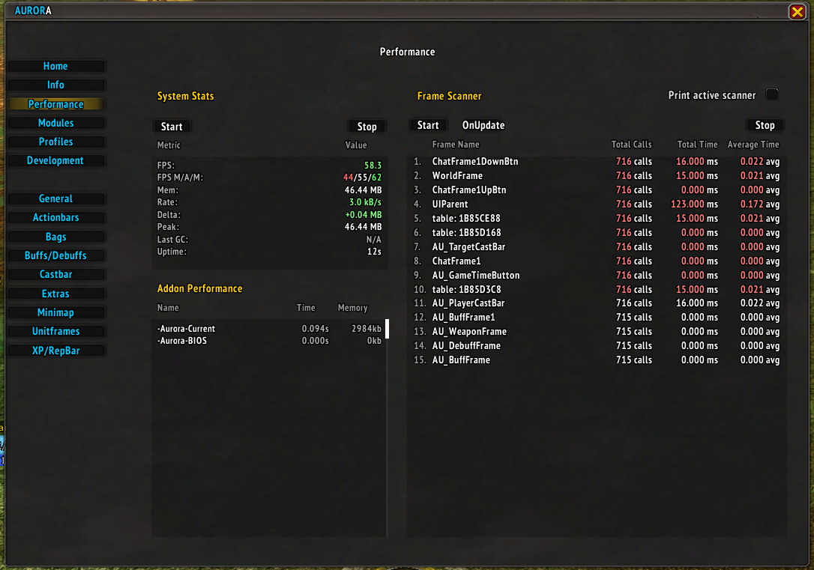
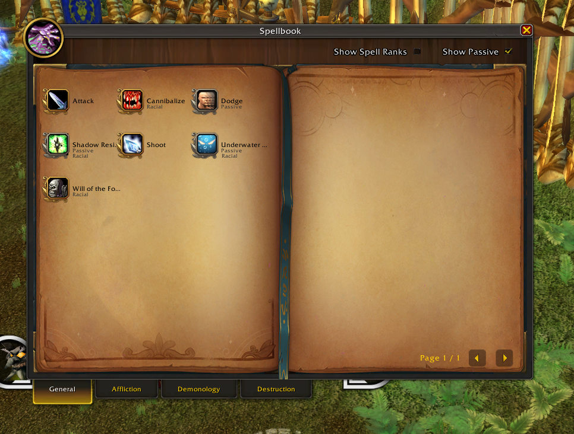
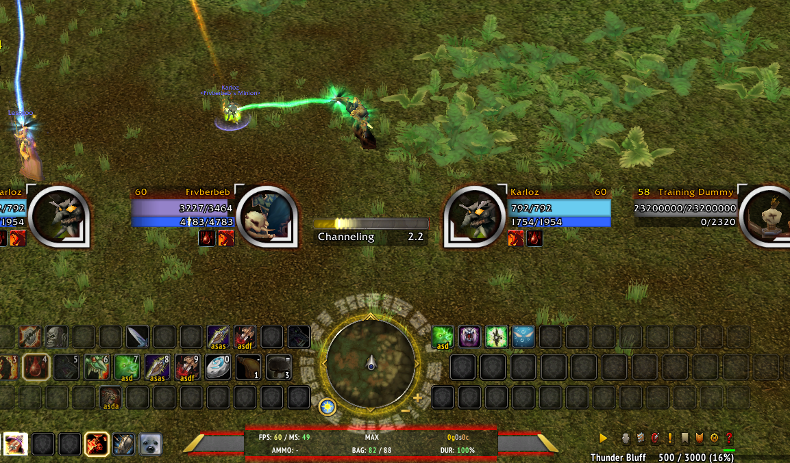
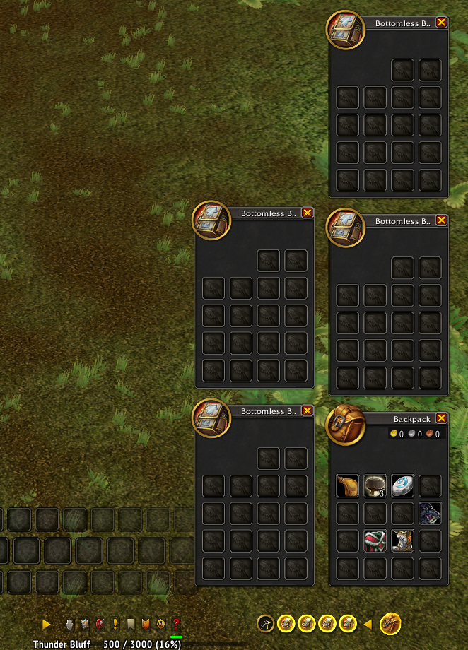
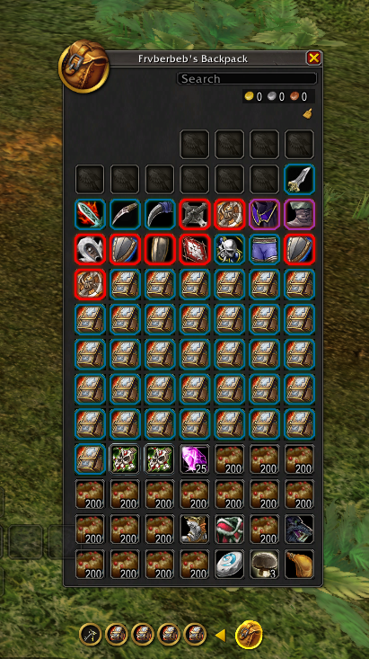
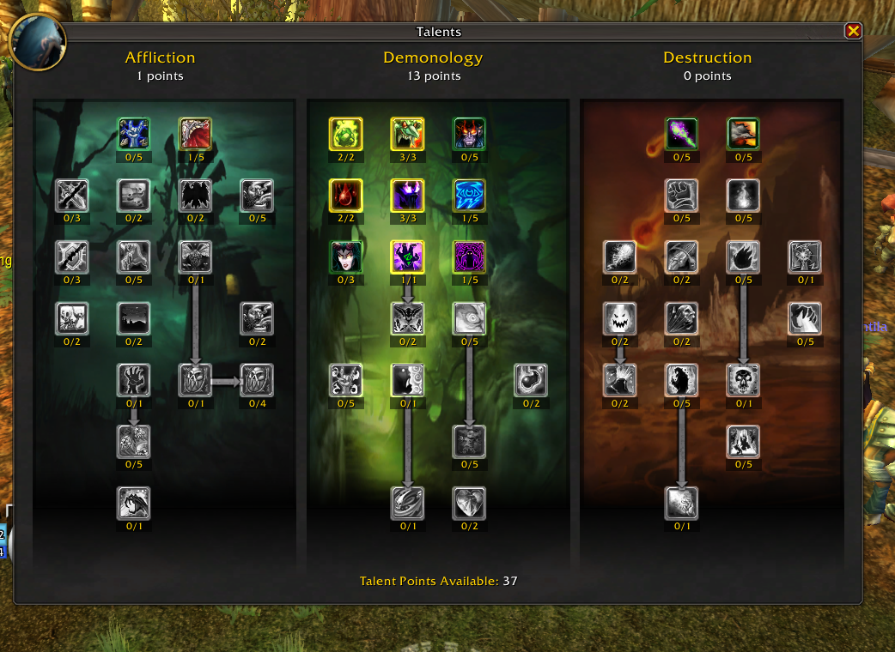
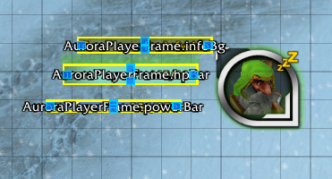
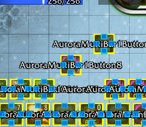
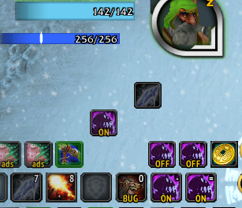

## Installation

1. Download or clone this repository
2. Copy both `-Aurora-BIOS` and `-Aurora-Current` folders into your `Interface/AddOns` directory
3. Restart WoW or reload UI (`/reload`)

## Requirements

- World of Warcraft 1.12.1
- Both addon folders must be installed together

## Usage

/au