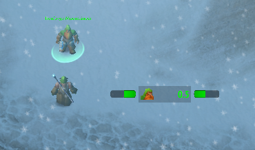
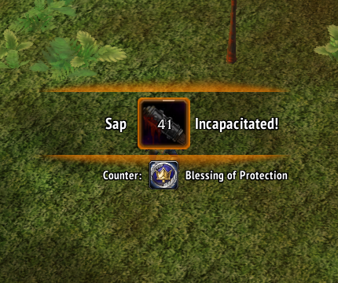
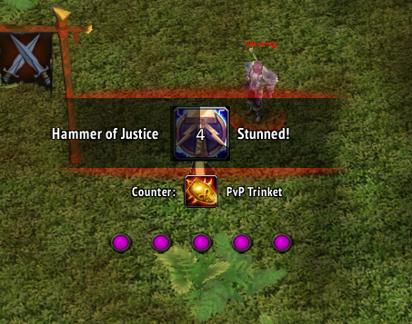

# Dragonflight 3

A comprehensive UI overhaul for World of Warcraft Vanilla 1.12.1.

**⚠️ Disclaimer: Solo developer, no affiliations with any server or organization, no monetization. Free and open-source for all Vanilla 1.12.1 clients.**

**⚠️ Requires [SuperWoW 1.5+](https://github.com/balakethelock/SuperWoW) and [UnitXP SP3](https://codeberg.org/konaka/UnitXP_SP3)**

## Features

- 1000+ customizable options
- Many animations and transitions
- 2-way edit mode
- Unique features and enhancements
- Complete interface redesign (ALPHA PHASE / REPORT BUGS)

## Screenshots

<table>
<tr>
<td></td>
<td></td>
<td></td>
</tr>
<tr>
<td></td>
<td></td>
<td></td>
</tr>
<tr>
<td></td>
<td></td>
<td></td>
</tr>
<tr>
<td></td>
<td></td>
<td></td>
</tr>
</table>

## Installation

1. Download or clone this repository
2. Copy `-Dragonflight3` folder into your `Interface/AddOns` directory
3. Restart WoW or reload UI (`/reload`)

## Usage

/df help